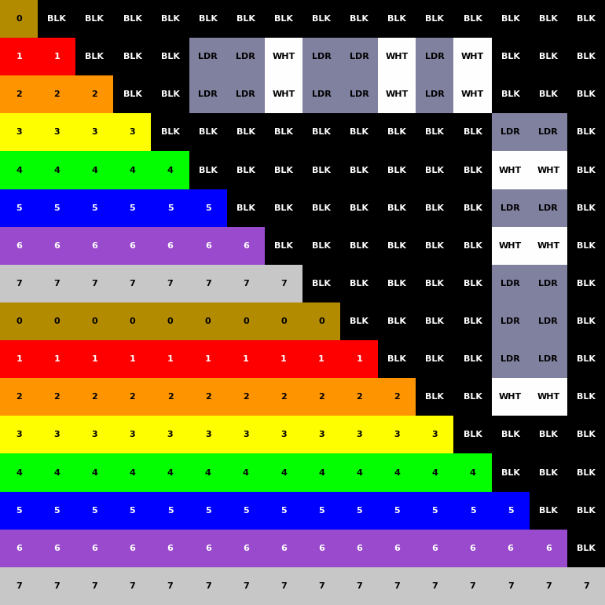

# Pixel Structure Pattern E 4k

## 1. 来源 (Source)
DCI CTP 7.5.3

## 2. 用途 (Purpose)
本测试图案用于验证显示设备的像素计数和像素结构完整性。

## 3. 特性 (Characteristics)
- **分辨率**: 4096x2160 (4K DCI)
- **图案结构**: 256×135 个 16×16 像素块
- **颜色序列**: 每个块包含 16 条颜色条带（Brown, Red, Orange, Yellow, Green, Blue, Violet, Gray，重复两次）
- **二进制索引**: 每个块包含 X/Y 坐标的二进制编码（白色=1，灰色=0）
- **方向**: E orientation - 水平扫描方向（从左到右）。彩条水平排列，上短下长，靠左对齐，形成向右的指向。
- **边框**: 1 像素白色边框

## 4. 验证方法 (Verification)
### 基本验证
1. 在显示设备上全屏显示该图案
2. 检查图像是否完整显示，无截断或缩放
3. 验证最外层白色边框是否可见
4. 确认像素结构清晰可辨

### 详细验证
- **像素计数**: 验证分辨率为 4096×2160
- **像素结构**: 检查 16×16 像素块的对角线阶梯图案
- **二进制索引**: 验证 X/Y 索引的二进制编码正确性
- **颜色准确性**: 确认 8 色序列符合 DCI 规范

## 5. 素材状态 (Material Status)
✅ **已生成 (Generated)**

该素材文件（16-bit XYZ TIFF）已包含在当前目录中。
文件路径: `Pixel_Structure_Pattern_E_4k.tiff`

由于文件较大，提供了压缩版本：`Pixel_Structure_Pattern_E_4k.zip`

## 6. 像素结构分析 (Pixel Structure Analysis)
根据 DCI 1.4.3 规范生成的 16×16 像素结构图（E orientation）。

### 结构图 (Structure Diagram)

*(示例块使用索引 X=81, Y=37 以展示二进制编码结构)*

### 验证 (Verification)
- **颜色映射**: 0-7 对应 Brown, Red, Orange, Yellow, Green, Blue, Violet, Gray
- **特殊值**: Black 映射为 "BLK"，White 映射为 "WHT"，Gray Marker 映射为 "LDR" (Gray)
- **索引编码**: 二进制梯采用 MSB-first 编码，白色代表 1，灰色代表 0
