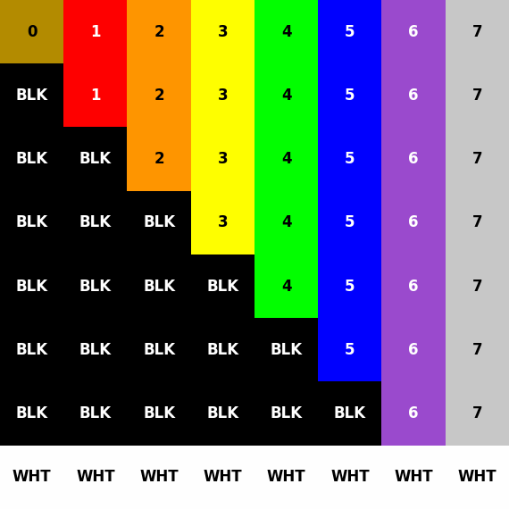

# Pixel Structure Pattern S 2k

## 1. 来源 (Location)
7.5.3

## 2. 用途 (Purpose)
验证显示设备的像素计数和结构(2K, South orientation)。

### 设计原理与意义 (Design Rationale & Significance)
**为什么说是为投影机设计的？(Why Projector-Centric?)**
除了分辨率因素，该图案的**结构设计**本身就是为了应对投影显示的特有挑战：
1.  **三色会聚 (Convergence/Registration)**: 影院投影机通常由3片DLP芯片(R/G/B)组成。此图案中精细的**1像素宽颜色条带**和**白色边框**是检测三色芯片物理对齐（会聚）的绝佳工具。如果R/G/B芯片未对齐，白色线条边缘会出现色边（Fringing）。（LED屏像素是物理固定的，不存在此问题）。
2.  **光学几何与梯形校正 (Optical Geometry & Keystone)**: **对角线阶梯**对重采样算法极度敏感。如果投影机开启了梯形校正（Keystone）或存在光学畸变，对角线将不再平滑，出现锯齿或模糊。
3.  **物理遮幅 (Physical Masking)**: 影院银幕常有物理遮幅（Masking）。**二进制索引梯**让放映员能精确读出银幕边缘被遮挡的具体像素行/列数，从而精确调整画幅。

**方向意义 (South Orientation):**
标准正向显示测试（从上到下）。这是最基础的测试，验证标准的信号扫描顺序和像素映射。

**分辨率意义 (2K Resolution):**
2K图案使用8x8像素块，结构相对简单。主要用于快速验证基本的像素对齐和色彩通道顺序。

## 3. 特性 (Characteristics)
2048x1080图像，由8x8像素块铺满。包含颜色条带和黑色阶梯背景。

## 4. 验证方法 (Verification)
### DCI合规性测试
根据CTP 7.5.3要求：
1. 在屏幕上完整显示该图案。
2. 目视检查像素结构是否完整，无截断、缩放或伪影。
3. 验证最外层像素是否可见。

### LED屏测试建议 (LED Display Recommendations)
虽然此图案设计初衷是针对数字影院投影机，但在LED屏测试中也有独特价值：
1. **信号链路验证**: 确认处理器未进行错误的缩放或裁剪。
2. **像素映射**: 验证1:1像素映射，特别是对于非标准分辨率的LED屏。
3. **模组方向**: 通过N/S/E/W四个方向的图案，可以快速识别模组物理安装方向或数据走线方向的错误。

**建议补充测试 (Recommended Additional Tests):**
- **纯色全屏**: 检测坏点和模组色差。
- **低灰阶渐变**: 测试LED屏特有的低亮非线性问题。
- **高帧率移动条**: 测试动态刷新率和扫描线问题。

### 素材文件验证
验证TIFF文件尺寸为2048x1080，且包含预期的网格结构。

## 5. 素材状态 (Material Status)
✅ **已生成 (Generated)**

该素材文件（16-bit XYZ TIFF）已包含在当前目录中。
文件路径: `Pixel_Structure_Pattern_S_2k.tiff`

## 6. 像素结构分析 (Pixel Structure Analysis)
根据DCI 1.4.3规范生成的8x8像素结构图（South orientation）。

### 颜色映射表 (Color Mapping Table)
| Y \ X | 0 | 1 | 2 | 3 | 4 | 5 | 6 | 7 |
|---|---|---|---|---|---|---|---|---|
| **0** | 0 | 1 | 2 | 3 | 4 | 5 | 6 | 7 |
| **1** | BLK | 1 | 2 | 3 | 4 | 5 | 6 | 7 |
| **2** | BLK | BLK | 2 | 3 | 4 | 5 | 6 | 7 |
| **3** | BLK | BLK | BLK | 3 | 4 | 5 | 6 | 7 |
| **4** | BLK | BLK | BLK | BLK | 4 | 5 | 6 | 7 |
| **5** | BLK | BLK | BLK | BLK | BLK | 5 | 6 | 7 |
| **6** | BLK | BLK | BLK | BLK | BLK | BLK | 6 | 7 |
| **7** | WHT | WHT | WHT | WHT | WHT | WHT | WHT | WHT |

### 结构图 (Structure Diagram)

### 验证 (Verification)
- **颜色映射**: 颜色映射到索引0-7，符合规范序列：Brown, Red, Orange, Yellow, Green, Blue, Violet, Gray。
- **特殊值**: Black映射为"BLK"，White映射为"WHT"。
